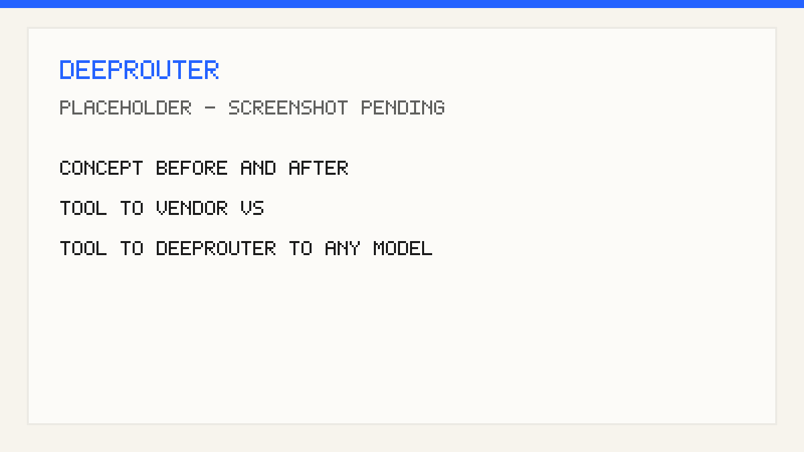
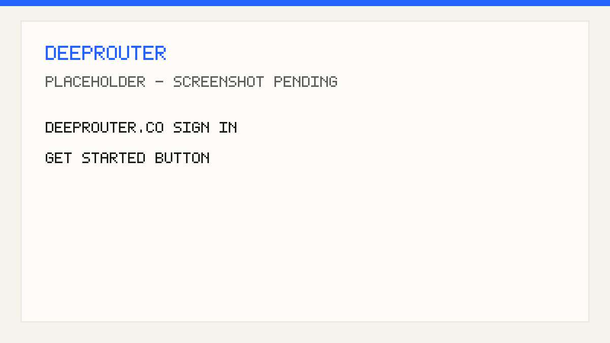
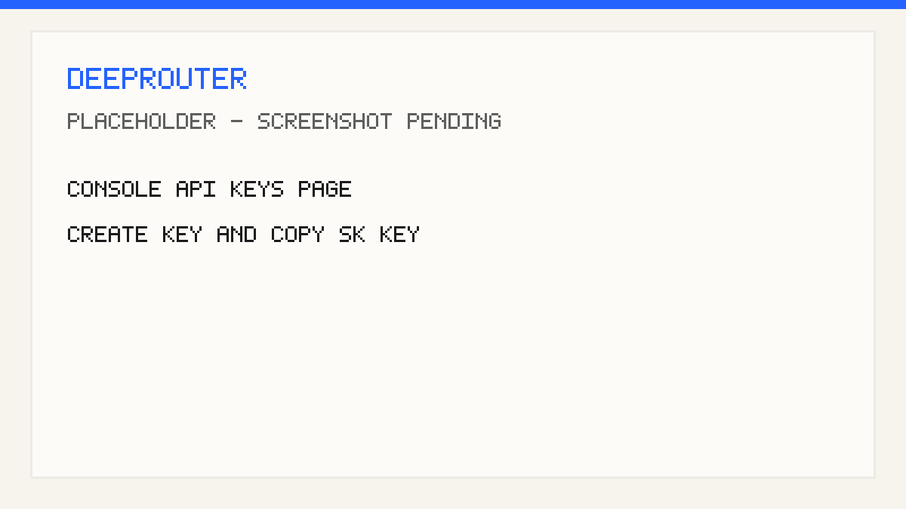
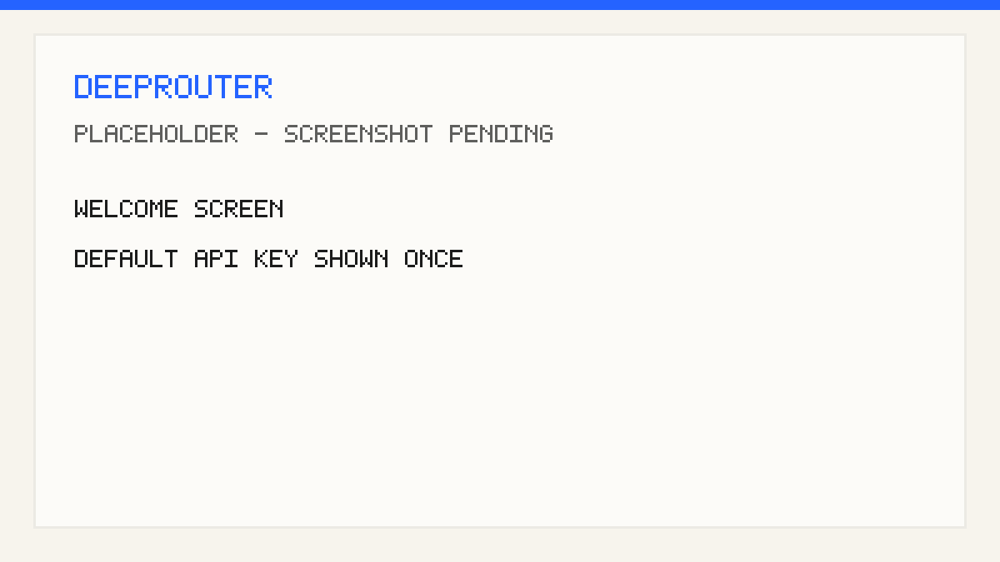
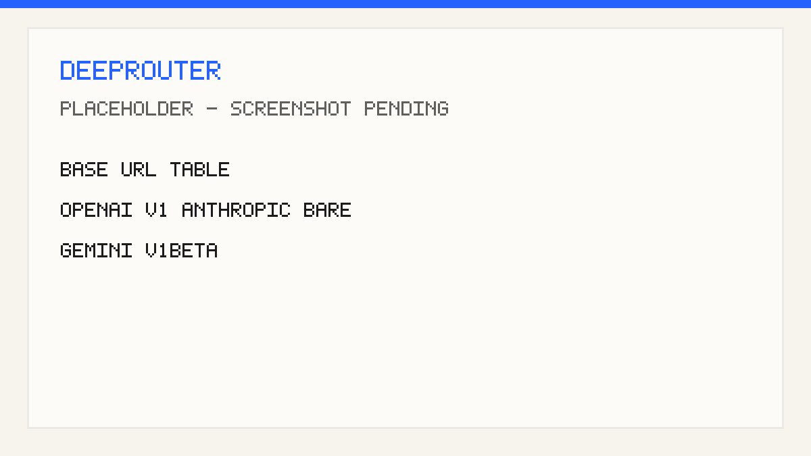
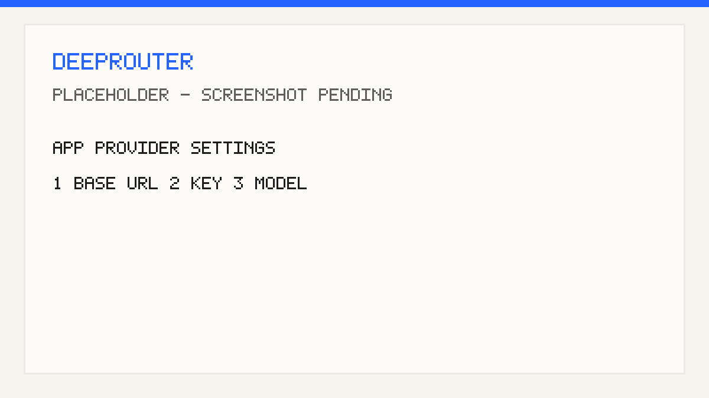
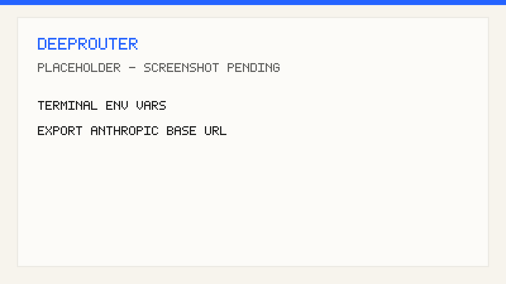
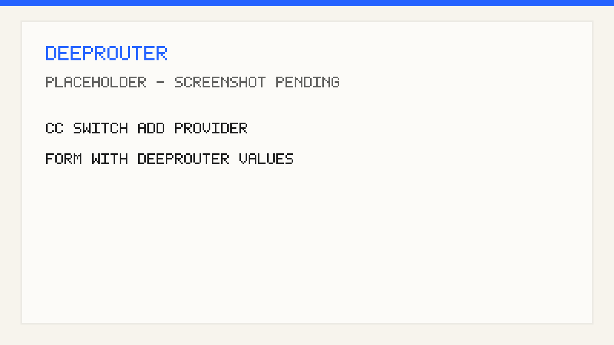
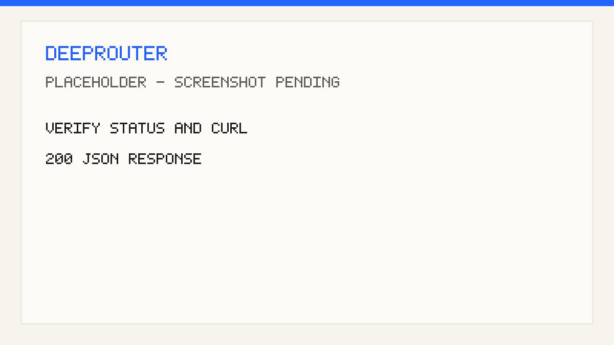

# The complete guide: connect any tool to DeepRouter

> **Who this is for** — anyone who already uses an AI tool (Claude Code, Cursor, a chat app,
> your own scripts…) and wants its requests to go through **DeepRouter** instead of straight to
> one model vendor. You do **not** need to be a developer. If you can copy a key and paste it
> into a settings box, you can do this.

This is the one document that explains the whole idea once. Each individual tool then has its
own short page (linked at the end) with the exact buttons for that tool.

---

## What "connecting to DeepRouter" actually means

Every AI tool needs to know two things to talk to a model:

1. **Where to send requests** — an *address*, called the **base URL**.
2. **Who you are** — a secret **API key**.

By default most tools ship pointed at one vendor (e.g. Anthropic or OpenAI) with that vendor's
key. **All you're doing is swapping those two values** so the tool talks to DeepRouter instead.
DeepRouter then picks the right model, handles fallback if one is down, and bills everything in
one place.

That's it. Nothing gets reinstalled. The tool looks and works the same.

> 
> <!-- IMAGE 01 — a simple before/after diagram: "Tool → Anthropic/OpenAI" on the left,
>      "Tool → DeepRouter → any model" on the right. Caption: only two values change. -->

---

## Step 1 — Get your DeepRouter API key

You need this once. Every tool uses the same key.

1. Go to **[deeprouter.co](https://deeprouter.co)** and sign in (or sign up).

   > 
   > <!-- IMAGE 02 — the deeprouter.co landing/sign-in page, arrow on the Sign in / Get started button. -->

2. Open the **console**, then go to **API Keys**.
3. Click **Create key** (or copy the default key shown). Copy the value — it starts with `sk-`.

   > 
   > <!-- IMAGE 03 — console → API Keys page. Highlight: the "Create key" button and the copy icon
   >      next to a key that starts with sk-. This is the single most important screenshot. -->

4. Paste it somewhere safe for a minute — you'll drop it into your tool next.

> 💡 Right after you first sign up, DeepRouter also shows a **default key once** on the welcome
> screen. If you saw it then and didn't copy it, don't worry — just create a new one here.
>
> 
> <!-- IMAGE 04 — welcome screen showing "Your default API key (shown once)". Optional. -->

---

## Step 2 — Find the right base URL

Tools ask for an "API type" or "provider". Match it to the address:

| Your tool's API type | Base URL to paste |
|---|---|
| **OpenAI** (most common) | `https://api.deeprouter.co/v1` |
| **Anthropic / Claude** | `https://api.deeprouter.co` |
| **Gemini / Google** | `https://api.deeprouter.co/v1beta` |

**Not sure which?** Pick **OpenAI** — it's what the majority of apps use. Never add a trailing
slash at the end.

> 
> <!-- IMAGE 05 — a clean graphic of the three-row table above. Used as a reference card. -->

---

## Step 3 — Put the two values into your tool

There are only **three styles** of setup. Find the one your tool uses; the per-tool page has the
exact clicks.

### Style A — Type a setting into a box (most apps)

Chat apps and editors (Cherry Studio, Chatbox, Cursor, LobeChat, OpenCat, Cline…) have a
**Settings → Model Provider** screen. You:

1. Add / choose a provider of type **OpenAI** (or Anthropic).
2. Paste the **base URL** from Step 2.
3. Paste your **API key** from Step 1.
4. Add a model name from the console **Model Catalog** (e.g. `claude-haiku-4-5`).
5. Save. Done.

> 
> <!-- IMAGE 06 — a representative app (e.g. Cherry Studio or Chatbox) settings screen with the
>      base URL field, API key field, and model field each circled and numbered 1-2-3. -->

### Style B — Set it in the terminal (coding CLIs)

Tools like **Claude Code**, **Codex**, **Gemini CLI** read from your environment. You paste two
lines into your terminal profile. Example for **Claude Code**:

```bash
export ANTHROPIC_BASE_URL=https://api.deeprouter.co
export ANTHROPIC_AUTH_TOKEN=sk-...your-key...
```

Then restart the tool. (Each CLI's page lists its exact variable names.)

> 
> <!-- IMAGE 07 — a terminal window showing the two export lines, then `claude` starting and the
>      status bar showing api.deeprouter.co. -->

### Style C — Use the CC Switch app (point-and-click, for Claude Code)

If you don't want to touch the terminal, **[CC Switch](./cc-switch.md)** is a small free app that
edits the config for you. You fill a form (name, URL `https://api.deeprouter.co`, your key) and
click **Use**.

> 
> <!-- IMAGE 08 — CC Switch "add provider" form filled in with the DeepRouter values, arrow on the
>      Use/Enable button. -->

---

## Step 4 — Check it's working

Two ways:

- **In a coding CLI:** run `/status` and confirm the base URL reads `https://api.deeprouter.co`.
- **Any tool / quick proof:** paste this in a terminal (swap in your key). A normal JSON reply
  means DeepRouter and your key are fine:

  ```bash
  curl https://api.deeprouter.co/v1/chat/completions \
    -H "Authorization: Bearer sk-...your-key..." \
    -H "content-type: application/json" \
    -d '{"model":"claude-haiku-4-5","messages":[{"role":"user","content":"hi"}]}'
  ```

> 
> <!-- IMAGE 09 — split image: left = a tool's /status showing api.deeprouter.co; right = a curl
>      command returning a 200 JSON response. -->

---

## Step 5 — If something's wrong

Run the curl in Step 4 first. **If curl works but the tool doesn't, it's the tool's setting** —
almost always one of these:

| What you see | The fix |
|---|---|
| Authentication / 401 error | Key is wrong or out of quota. Re-copy from console → API Keys. |
| Connection timeout | You left a **trailing slash** on the URL. Remove it. |
| Still hitting api.anthropic.com / api.openai.com | An old setting or a logged-in vendor session is overriding. Re-check the base URL and restart the tool. |
| `model not found` | That model isn't enabled for your account — pick one from the **Model Catalog**. |
| Tool has no place to set a base URL | It's locked to one vendor. See [Any other tool](./others.md) for a proxy workaround. |

---

## Step 6 — Pick your tool's exact guide

Same key, same idea — these just show the precise buttons per tool.

**Coding CLIs:** [Claude Code](./claude-code.md) · [Codex](./codex.md) · [Gemini CLI](./gemini-cli.md) · [OpenCode](./opencode.md)

**Editors:** [Cursor](./cursor.md) · [GitHub Copilot](./copilot.md) · [Cline](./cline.md) · [Zed](./zed.md)

**Desktop & chat apps:** [Claude Cowork](./claude-coworks.md) · [OpenClaw](./openclaw.md) · [Cherry Studio](./cherry-studio.md) · [BotGem](./botgem.md) · [Chatbox](./chatbox.md) · [LobeChat](./lobehub.md) · [OpenCat](./opencat.md) · [NextChat](./nextchat.md) · [WorkBuddy](./workbuddy.md)

**Helpers, SDKs & frameworks:** [CC Switch](./cc-switch.md) · [OpenAI SDK](./openai-sdk.md) · [LangChain](./langchain.md) · [LlamaIndex](./llamaindex.md)

**Browser & other:** [Immersive Translate](./immersive-translate.md) · [Any other tool](./others.md)

---

## One-glance reference

| Protocol | Base URL | Endpoint called | Auth header |
|---|---|---|---|
| Anthropic | `https://api.deeprouter.co` | `POST /v1/messages` | `x-api-key` or `Authorization: Bearer` |
| OpenAI | `https://api.deeprouter.co/v1` | `POST /chat/completions` | `Authorization: Bearer` |
| Gemini | `https://api.deeprouter.co/v1beta` | `POST /models/...:generateContent` | `x-goog-api-key` or key param |

Key: console → **API Keys** (`sk-...`). Models: console → **Model Catalog**.

---

*Screenshots in this guide are being captured and will appear here shortly.*
